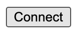

## FUNDME-HTML

This is a minimalistic example what you can find in the [metamask docs](https://docs.metamask.io/guide/create-dapp.html#basic-action-part-1).

- [Requirements](#requirements)
- [Quickstart](#quickstart)
- [Thank you!](#thank-you)


# Requirements

- [git](https://git-scm.com/book/en/v2/Getting-Started-Installing-Git)
  - You'll know you've installed it right if you can run:
    - `git --version`
- [Metamask](https://metamask.io/)
  - This is a browser extension that lets you interact with the blockchain.

# Quickstart 

1. Clone the repo

```
git clone https://github.com/nwachee/randomSolids.git
cd fundMe-Html
```

2. Run the `index.html` file

You can usually just double click the file to "run it in the browser". Or you can right click the file in your VSCode and run "open with live server" if you have the live server VSCode extension (ritwickdey.LiveServer).

And you should see a small button that says "connect".



Hit it, and you should see metamask pop up.

> **PLEASE USE A METAMASK ACCOUNT THAT ISNT ASSOCIATED WITH ANY REAL MONEY.**
> I usually use a few different browser profiles to separate my metamasks easily.

# Thank you!